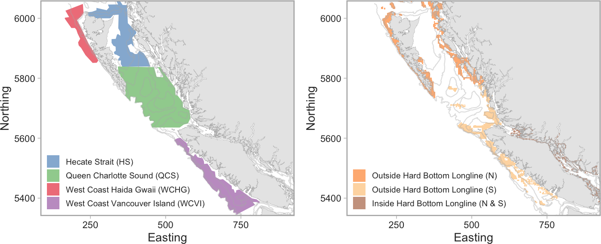
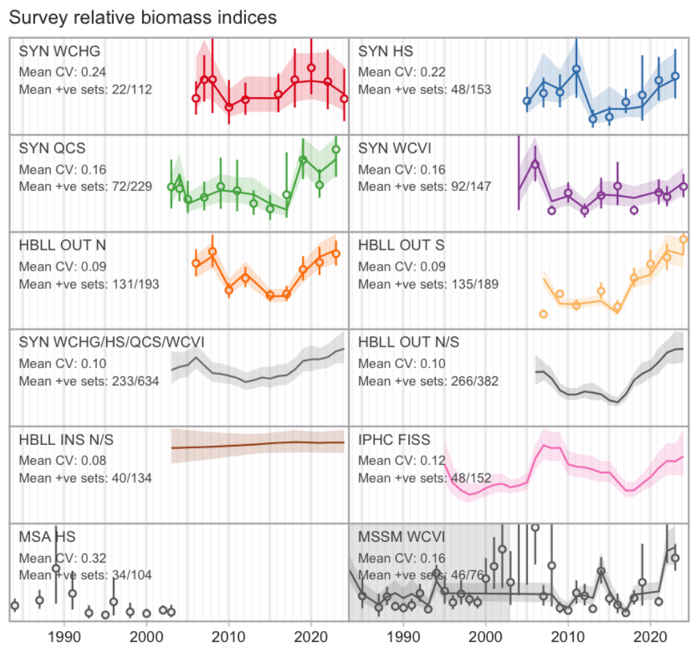
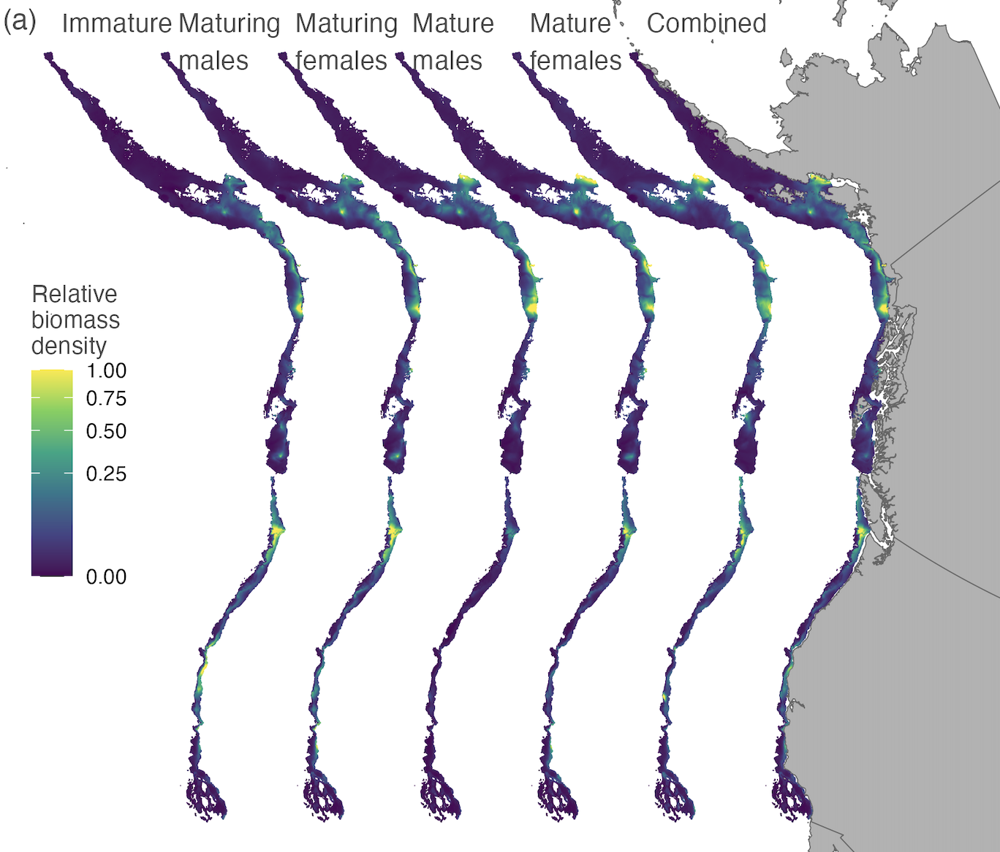
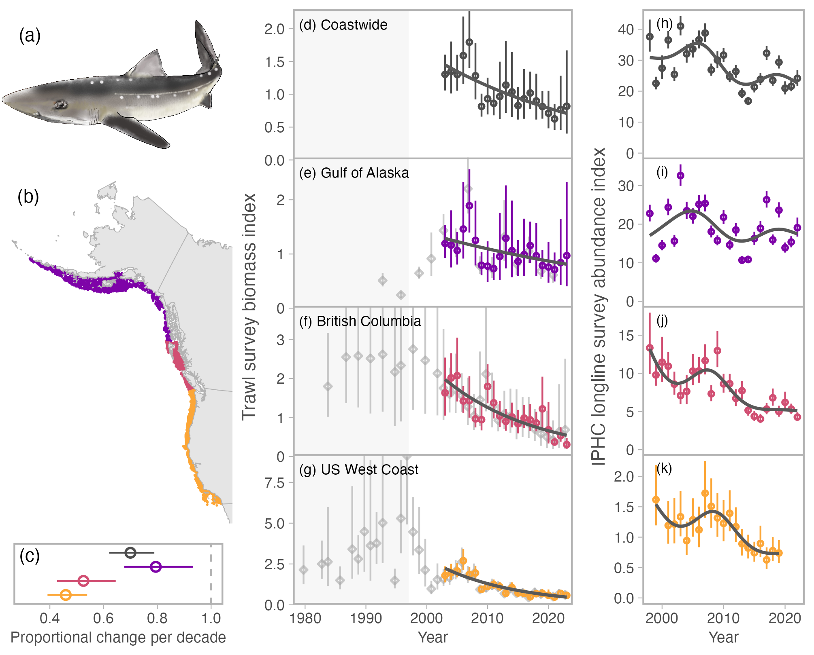

<!-- Build with: xaringan::inf_mr() -->

```{r preamble, include=FALSE, cache=FALSE}
source(here::here("preamble.R"))
do.call(knitr::opts_chunk$set, knitr_opts)
```

```{r libs, include=FALSE}
library(dplyr)
library(sdmTMB)
library(ggplot2)
library(mgcv)
```


# Data integration

Employing multiple data sources in the same population, stock assessment, or species distribution model.

--

Also known as "data fusion" or "integrated analysis".

--

Different data sources could be 
.small[
- multiple surveys of the same kind
- surveys with different gear
- commercial CPUE
- different data types (e.g., presence-absence with count data)
]

---

# Types of data integration

Spatial domain: same domain vs. "expanded domain"

Catchability: equal, constant difference, spatially varying

Any combination of these

With (or sometimes without) comparative fishing

.tiny[
[Grüss et al. (2025) Fisheries Research](https://doi.org/10.1016/j.fishres.2025.107321)
]

---

# Expanded domain

Examples:

Two or more surveys by the same agency together covering a coastline (e.g., BC groundfish biennial surveys)

--

Two or more surveys run by neighbouring agencies with somewhat different gear but enough spatiotemporal proximity to calibrate

---

# Expanded domain example

.small[BC groundfish surveys: same gear, biennial sampling design (don't do this!)]

.center[

]

.tiny[[Anderson et al. annual Pacific groundfish synopsis reports](https://github.com/pbs-assess/gfsynopsis)]

---

# Expanded domain example

.small[BC groundfish surveys: same gear, biennial sampling design]

.center[

]

.tiny[[Anderson et al. annual Pacific groundfish synopsis reports](https://github.com/pbs-assess/gfsynopsis)]

---

# Expanded domain example

.small[Northeast Pacific Ocean Pacific Spiny Dogfish:<br>NOAA + DFO trawl surveys]

.center[

]

.xtiny[
Davidson, L.N.K., English, P.A., King, J., Grant, P.B.C., Taylor, I.G., Barnett, L.A.K., Gertseva, V., Tribuzio, C.A., and Anderson, S.C. 2026. Mystery of the disappearing dogfish: transboundary analyses reveal steep population declines across the Northeast Pacific with little evidence for regional redistribution. Fish and Fisheries 27(1): 1–12. https://doi.org/10.1111/faf.70028.
]

---

# Expanded domain example

.small[Northeast Pacific Ocean Pacific Spiny Dogfish:<br>NOAA + DFO trawl surveys]

.center[

]

.xtiny[
Davidson, L.N.K., English, P.A., King, J., Grant, P.B.C., Taylor, I.G., Barnett, L.A.K., Gertseva, V., Tribuzio, C.A., and Anderson, S.C. 2026. Mystery of the disappearing dogfish: transboundary analyses reveal steep population declines across the Northeast Pacific with little evidence for regional redistribution. Fish and Fisheries 27(1): 1–12. https://doi.org/10.1111/faf.70028.
]

---

class: center, middle, inverse

# Why data integration?

---

# Why data integration?

.small[
Model a species over a larger range (e.g., for transboundary distribution shift metrics and better estimates of environmental covariates of distribution)
]

--

.small[
Can make use of available data, often yielding more accurate and precise distribution predictions
]

--

.small[
For single synthetic population indices:
- Assessment models aren't usually equipped to combine spatial data
- Often statistically convenient
- Sometimes necessary when designing management procedures
- Fish Stocks provisions "one stock, one LRP" guidance
]

---

class: center, middle, inverse

# What is the theory behind data integration?

---

# Regression discontinuity design (RDD)

The ability to integrate data depends on the concept of regression discontinuity design.

```{r, out.width="70%"}
library(ggplot2)
library(dplyr)
set.seed(123)
n <- 200
running <- seq(1400, 2800, length.out = n)
cutoff <- 2000
treatment <- ifelse(running >= cutoff, 1, 0)

# Simulate outcomes with different intercepts/slopes on each side
outcome <- 1000 + 0.9 * running + 300 * treatment + rnorm(n, 0, 100)

# Combine into a data frame
df <- data.frame(running, outcome, treatment = factor(treatment))

# Fit regressions on each side of the cutoff
fit0 <- lm(outcome ~ running, data = df[df$running < cutoff, ])
fit1 <- lm(outcome ~ running, data = df[df$running >= cutoff, ])

# Predict fitted lines for plotting
pred0 <- data.frame(running = seq(min(df$running), cutoff, length.out = 100))
pred1 <- data.frame(running = seq(cutoff, max(df$running), length.out = 100))
pred0$fit <- predict(fit0, newdata = pred0)
pred1$fit <- predict(fit1, newdata = pred1)

# Plot
ggplot(df, aes(x = running, y = outcome, color = treatment)) +
  geom_point(alpha = 0.8) +
  geom_line(data = pred0, aes(y = fit), color = "black") +
  geom_line(data = pred1, aes(y = fit), color = "black") +
  geom_vline(xintercept = cutoff, color = "red") +
  labs(
    x = "Covariate value",
    y = "Outcome"
  ) +
  scale_color_manual(values = c("steelblue", "orange")) +
  theme_minimal() +
  theme(legend.title = element_blank())
```

---

# Regression discontinuity design for surveys

There's an underlying density of fish; we can sample it in various ways.

--

We might sample the same location with two sets of trawl gear — the discontinuity is the gear type.

--

We might sample two neighbouring regions with the same trawl gear — the discontinuity is the border.

--

We might sample a region with longline gear and count fish. Another survey might trawl and weigh the fish. The discontinuity is the gear type and data type.

---

# Different likelihoods

Data integration can be with the same or different likelihoods.

--

Examples:

**Same**: two surveys that collect catch weight (e.g., delta-Gamma or Tweedie)

--

**Different**: catch count (Poisson) + presence-absence (Bernoulli with cloglog link)

---

### Combining all continuous positive, count, and 0-1 data (😲)

.xsmall[
Idea: there's an underlying surface of fish population intensity. You observe it as weight, count, or presence-absence.
]

--

.xsmall[
Internally, share linear predictors and convert them into different observation likelihoods.
]

--

.xsmall[
Key concepts:
- a cloglog-linked Bernoulli can be thought of as a "thinned" observation of a count process
- a Poisson-link delta model has an underlying "count" model and a weight per "count"
]

.tiny[
Grüss, A., and Thorson, J.T. 2019. Developing spatio-temporal models using multiple data types for evaluating population trends and habitat usage. ICES Journal of Marine Science <https://doi.org/10.1093/icesjms/fsz075>.
]


---

class: center, middle, inverse

# Examples of data integration with sdmTMB

<br>

.center[

]

.small[
Using different likelihoods per row of data is available in the dev branch of sdmTMB. See the [dev](https://github.com/sdmTMB/sdmTMB/tree/dev) branch and [this vignette](https://github.com/sdmTMB/sdmTMB/blob/dev/vignettes/articles/multi-family.Rmd).
]

---

# Accounting for catchability

Constant catchability coefficient:

```{r, eval=FALSE, echo=TRUE}
formula = catch ~ ... + factor(gear)
```

--

Spatially varying catchability coefficient:

```{r, eval=FALSE, echo=TRUE}
formula = catch ~ ... + factor(gear),
spatial_varying = ~ 0 + factor(gear)
```

--

Time-varying catchability coefficient:

```{r, eval=FALSE, echo=TRUE}
formula = catch ~ ... + factor(gear),
time_varying = ~ 0 + factor(gear)
```

--

Mind your base gear factor level!

---

# Accounting for catchability in an index

Predict on a grid for a reference gear type:

```{r, eval=FALSE, echo=TRUE}
grid$gear <- factor("vessel A", #<<
  levels = c("vessel A", "vessel B")) #<<
```

--

Proceed as usual with area-weighted density summation:

```{r, eval=FALSE, echo=TRUE}
pred <- predict(fit, newdata = grid)
index <- get_index(pred)
```

---

# Extending to selectivity

Add gear-length-bin interaction:

```{r, eval=FALSE, echo=TRUE}
formula = catch ~ ... + 
  factor(gear) * factor(length_bin) #<<
```

--

Replicate `grid` for each `length_bin`:

```{r, eval=FALSE, echo=TRUE}
unique(grid$length_bin) 
#> [1] 0-10  10-20 20-30
#> Levels: 0-10 10-20 20-30
```

--

Sum across grid cells *and* length bins:

```{r, eval=FALSE, echo=TRUE}
pred <- predict(fit, newdata = grid)
index <- get_index(pred)
```

---

### Multi-likelihood syntax to combine data types

```{r, eval=FALSE, echo=TRUE}
family_list <- list(
  binomial = binomial(link = "cloglog"),
  poisson = poisson()
)
```

```{r, eval=FALSE, echo=TRUE}
unique(dat$data_type)
#> [1] "poisson" "binomial" 
```

```{r, eval=FALSE, echo=TRUE}
fit <- sdmTMB(
  response ~ factor(year) + factor(data_type),
  family = family_list,
  distribution_column = "data_type",
  ...
)
```

---

class: center, middle, inverse

# Food for thought on data integration and open questions

---

## Should I integrate data?

.small[
Do they represent the same population?
]

--

.small[
Are the selectivities similar enough if you're not controlling for selectivity?
]

--

.small[
Do the datasets give a similar impression on their own?
]

--

.small[
Does a secondary data source substantially change parameter estimates from those of a trusted data source ([Rufener et al. 2021 Ecol. Appl.](https://onlinelibrary.wiley.com/doi/abs/10.1002/eap.2453))?
]

--

.small[
Does it help or hinder your stock assessment to create an integrated index?
]


---

# Open questions

.small[
Can spatially varying coefficients go awry with expanded domain integration?
]

--

.small[
What natural (or intentional) experiments are available to test data integration (and model-based approaches in general)?
]

--

.small[
How much do we gain from comparative fishing? Should we do the calibration within the index standardization model or separately?
]

--

.small[
What should be standard diagnostics to evaluate data integration and identify concerns?
]

--

.small[
Are we over-promising what we can do with models? How will we know if we have sensible outputs?
]

---

class: center, middle, inverse

# Conclusions

---

# Conclusions

Data integration is still relatively new in applied stock assessment. It is powerful and promising. It *can*:

--

* improve distribution and index estimate accuracy

--

* reduce uncertainty

--

* fill spatial and temporal gaps

--

* rescue expensive (but short or incomplete) survey data that may be of minimal use on their own

--

* produce reduced synthetic data products that are simpler to use

---

# Conclusions

But model-based data integration runs the risk of:

--

* losing multiple stories the data are telling us

--

* confusing meeting participants with ever more complex models

--

* ignoring data elements that may be important to account for (e.g., selectivity)

--

* going awry in ways that we have not yet anticipated

---

# My take

This is a promising field that is still relatively unexplored.

Let's do the research to figure out what guardrails and best practice guidelines we need to get the best of the approaches while limiting or at least being aware of the downsides.
